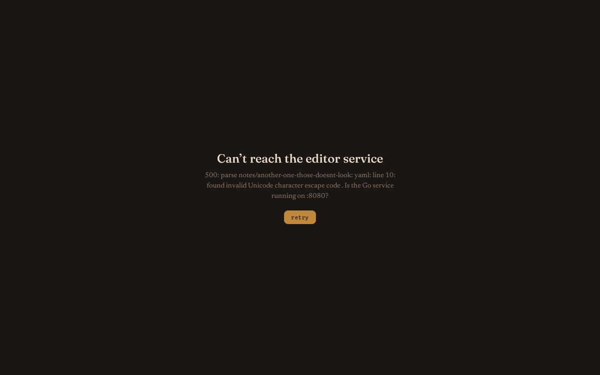
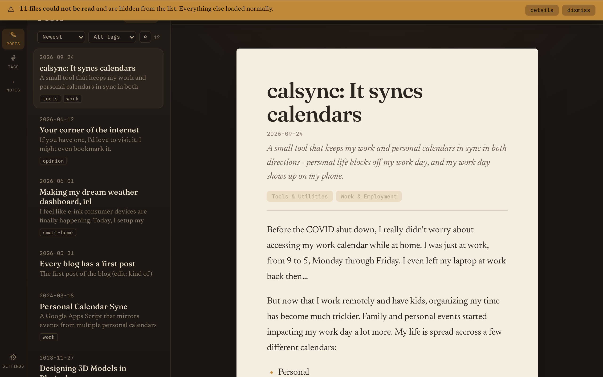
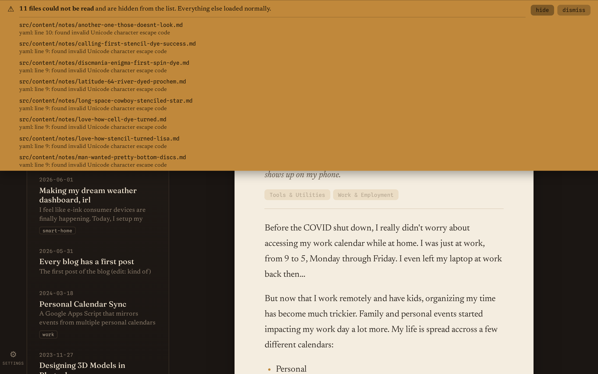
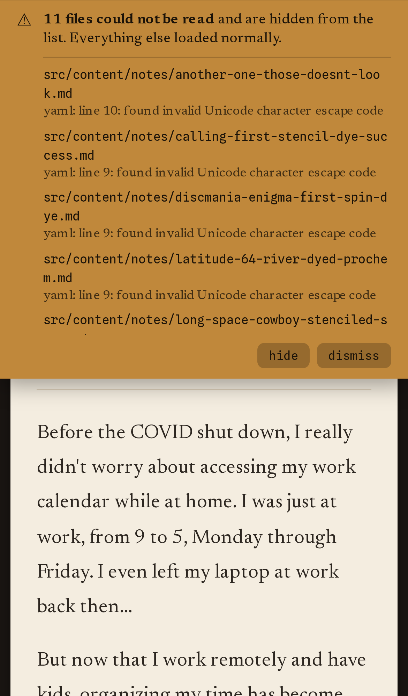
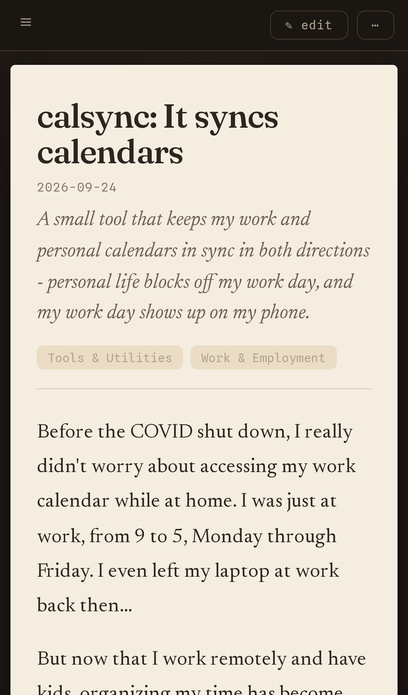
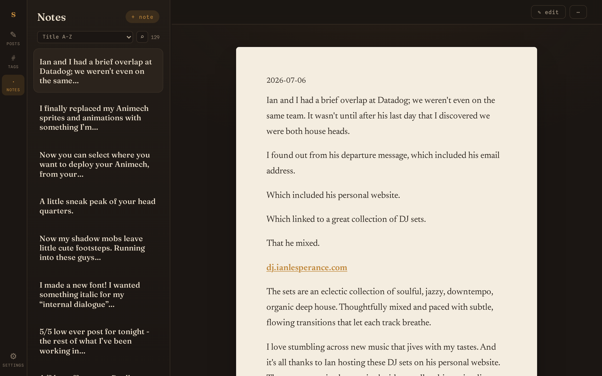
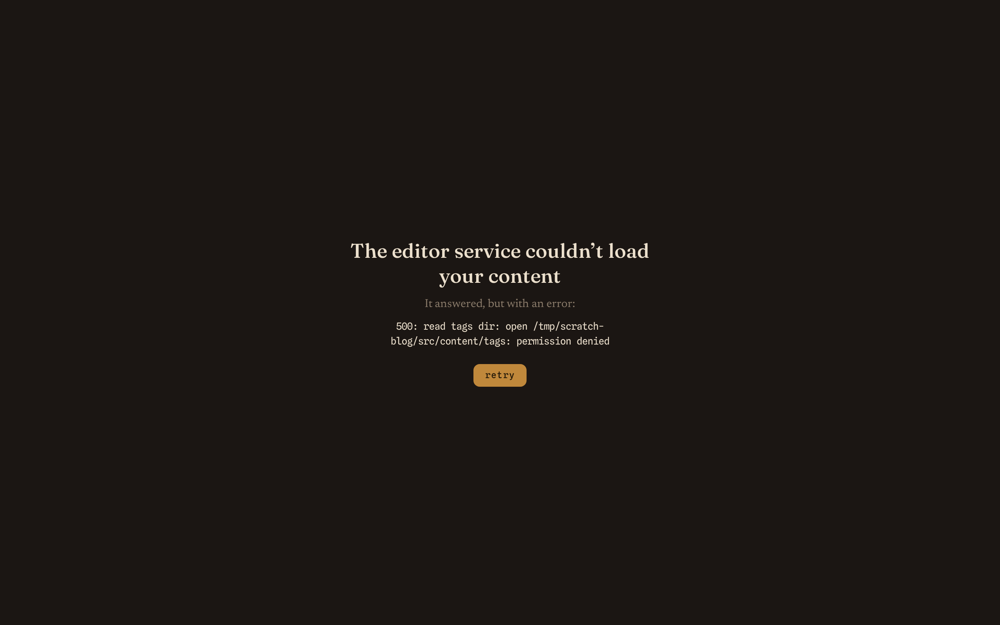
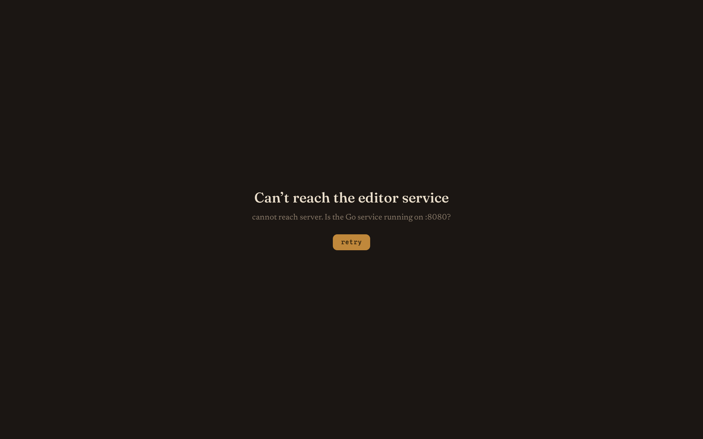

# Summary

Scribe now loads the editor and names the files it couldn't read, instead of showing the crash screen because of one bad note. Branch `relay-23` in `fisherevans/scribe`, three commits, not merged.

## Before / After

Both screenshots are the same binary against the same content tree - a clone of the blog with the eleven notes that carry `😅`-style emoji escapes still in them. Before, one of those files 500'd the list call and the whole editor was gone. After, 129 of 140 notes load and the eleven are named in a banner you can dismiss.

## What it tells you

"details" expands to the file path and the parse error for each one, so the fix list is right there. The error is trimmed of the `parse notes/<slug>:` prefix because the path above it already says that.

## On the phone

The message takes the full width and the buttons drop to their own row; the list scrolls. Dismissed, you get a clean editor.

## The notes collection itself

This is the collection that was taking the app down. 129 notes, listed and editable.

## When something really is wrong

The old crash screen said "Is the Go service running on :8080?" for every failure - including the one where the service answered and told us exactly what was wrong, which is what sent this outage looking at a healthy pod. It now quotes what the server said. The unreachable case keeps the old copy, because there it was right.

## What I did and why

`content.Store.List` returned on the first `Read` error. Everything downstream inherited that: the list endpoint 500'd, the editor's load promise rejected, and the app fell to its crash screen. One character in one file out of 150 made a writing tool unusable. `List` now skips the file, records a `Problem{slug, path, error}`, and keeps going. Its error return is reserved for collection-level failures - an unknown collection or a directory it can't read - because those genuinely have no partial answer.

The list endpoint returns `{resources, problems}` rather than a bare array. The alternative was leaving the array alone and putting problems on a separate endpoint, which would have kept the wire format compatible. The envelope won because scribe embeds and serves its own UI (no service worker, so no version skew), and the app already fetches every collection at load - the problems ride along instead of costing a second round trip per collection.

Skipped files log at warn once per distinct error, not on every list. The app polls, so an unconditional warn would write the same line forever; a *changed* error still logs, so a half-fixed file shows up.

The crash screen was the other half of the request. It had one message for three different situations. Now it splits them: unreachable keeps the old copy, signed-out says so, and a server error is quoted verbatim under "It answered, but with an error:".

## Verified

- `GOWORK=off go test ./...` passes, including two new `internal/content` cases: one good + one unparseable file in a collection, and the collection-level failures that must still error.
- `GOWORK=off go vet ./...` clean.
- `cd web && npm test` - 33 tests, 5 files, all pass.
- `tsc --noEmit` clean.
- Ran the pre-change binary and the post-change binary against the same clone of the blog, with the eleven broken notes in place: `GET /api/c/notes` goes from `500 parse notes/another-one-those-doesnt-look: yaml: line 10: ...` (the exact error in your screenshot) to `200` with 129 resources and 11 problems.
- The service logs exactly 11 warn lines for those files, and re-listing twice more adds none - the dedupe works.
- Drove the banner with `uidrive` at desktop and phone widths: collapsed, expanded, dismissed, and the notes collection loading behind it.
- Forced a real collection-level 500 (made the `tags` directory unreadable) and confirmed the crash screen quotes the server's message rather than asking about :8080.
- Forced a real connection failure and confirmed the unreachable copy still appears.

## Decisions made

- **Envelope over a side endpoint** for the list response, reasoning above. It is a breaking wire change, which is safe only because the service ships its own UI in the same image - worth knowing if an external client is ever pointed at this API.
- **The banner overlays the top of the app** rather than pushing it down, matching the four banners already there; it covers the collection header while it is up. I made it dismissible (the sync-degraded banner is not) because the condition it reports lasts as long as it takes to fix the files. Making one banner reflow the layout would have meant changing `.app`'s fixed-height model for all of them, which is a bigger change than this request.
- **Opening a broken file directly** is still not possible - it is absent from the list, so there is nothing to click and nothing to deep-link to. It fails as a missing resource, not a crash. Making broken files openable-as-raw-text would be a real feature; I did not build it.

## Not verified

- Nothing is merged, released or deployed. `scribe.fisher.sh` is still on `v0.4.0` and still shows the crash screen until the eleven notes are fixed (that is fisher-sh#4, a different worker, in `fisherevans/log`).
- I tested against a clone of the blog at `/tmp/scratch-blog`, never the live tree scribe serves.
- I did not test the two fixes together - this change makes a broken file survivable, the other removes the broken files; neither depends on the other.

## To pick this up again

Branch `relay-23` in `fisherevans/scribe`, three commits on top of `ebacad0`.

To release and deploy, per the deploy seed's scribe section:

1. Merge `relay-23` to `main` in `fisherevans/scribe`, tag `v0.4.1`, let the Action publish `ghcr.io/fisherevans/scribe:v0.4.1`.
2. In nottingham-cloud, bump `image:` on line 26 of `k3s/projects/scribe/deployment.yaml` from `v0.4.0` to `v0.4.1` and apply.
3. Load `scribe.fisher.sh`. With fisher-sh#4 landed it should show no banner at all; without it, the banner names eleven notes and the editor works.

The changelog entry (`changelog/2026-10-01-survive-one-bad-file.md`) names `v0.4.1` already - correct it if the tag ends up different.

To re-run the before/after locally: clone the blog to a scratch dir, build both binaries, and serve them on two ports with `--repo <scratch> --web-dir <dist> --no-git --addr :818x`. A fresh scribe worktree has no `web/node_modules` - `npm ci` first, and build with `npx -y node@22.12.0 node_modules/.bin/vite build` (the devbox default Node is 20.19 and Vite 5 wants newer).

## Playbook

- `projects/personal-site/seeds/deploy.md` covers the Node-22 workaround only for the Astro sites. It applies to scribe's `web/` too - `npm run build` and `vite build` both fail on the devbox's default Node 20.19. Worth saying so in the scribe section.
- The same section could note that `scripts/repo-wt.sh add scribe <branch>` gives a worktree with no `web/node_modules`, so `npm ci` in `web/` is the first step before any web build or `npm test`.
